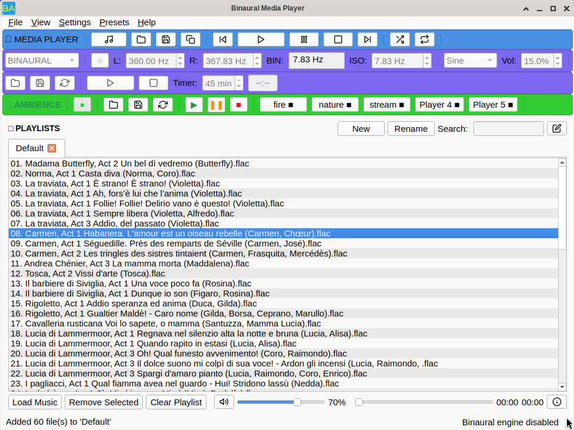

# Binaural Media Player



A sophisticated desktop application for multimedia playback, binaural/isochronic tone generation, and brainwave entrainment, built with **Qt 6** and **C++17**.

## Download Options

| Platform | Where to Get It |
| :--- | :--- |
| **Linux** | [Flathub](https://flathub.org/en/apps/search?q=alamahant) |
| **Windows** | [Buy on Gumroad](https://jnanadhakini.gumroad.com/l/ffllx) - Pre-compiled binary, no compilation needed |


---

## ✨ Features

### 🎵 Media Playback

* **Multi-format support:** MP3, WAV, FLAC, OGG, M4A, MP4, M4V, AVI, MKV
* **Tabbed playlists:** Create, rename, and manage multiple playlists
* **Advanced playback:** Shuffle, repeat, seek, volume control with mute
* **Streaming support:** Play audio directly from HTTP/HTTPS URLs
* **Time display:** Track position/duration with seekable progress bar

### 🧠 Brainwave Audio Generation

* **Three modes:** Binaural Beats (headphones required), Isochronic Tones, Audio Generator
* **Real-time dynamic engine:** Immediate parameter changes; no pre-rendered buffers
* **Waveforms:** Sine, Square, Triangle, Sawtooth
* **Frequency control:** Left/right channels (20Hz–20kHz)
* **Auto-stop timer:** With countdown visualization

### 📋 Playlist Management

* **Tabbed interface:** Multiple named playlists with closeable tabs

* **Search function:** Filter tracks within any playlist
* **File operations:** Save/load playlists in JSON
* **Track operations:** Add, remove, clear with smart selection tracking

### 🎨 User Interface

* **Custom toolbars:** Color-coded (Media: Blue, Binaural: Purple, Nature: Green)
* **Split status bar:** Media playback (left), binaural engine status (right)
* **Icon set:** 291 SVG icons
* **Responsive layout:** Graceful resizing
* **Safety warnings:** First-launch + brainwave activation warnings

---

## 🛠️ Technical Architecture

### Core Components

* **MainWindow:** Primary UI controller (3500+ lines)
* **DynamicEngine:** Real‑time audio generator
* **QMediaPlayer:** Multimedia backend
* **QAudioOutput / QAudioSink:** Low‑level audio routing

### Audio Pipeline

* **Generated Audio:** User Input → DynamicEngine → QAudioSink → System
* **Media Playback:** Media → QMediaPlayer → QAudioOutput → System

### Data Management

* **Playlists:** `QMap<QString, QStringList>`
* **Presets:** JSON with versioning + metadata
* **Settings:** QSettings
* **State Tracking:** Playback positions, selections

---

## 📦 Installation & Build

### Prerequisites

* Qt 6 (qt6-base, qt6-multimedia)
* C++17 compiler (GCC/Clang/MSVC)
* CMake 3.16+ or qmake
* FFmpeg (recommended)

### Build (CMake)

```bash
git clone https://github.com/alamahant/BinauralPlayer.git
cd BinauralPlayer
mkdir build && cd build
cmake -DCMAKE_PREFIX_PATH=/path/to/qt6 ..
make -j$(nproc)
```

### Build (qmake)

```bash
qmake Binaural.pro
make -j$(nproc)
```

### Run

```bash
./BinauralPlayer

```
## 🎮 Usage Guide

### Basic Playback

* Add files via button or drag & drop
* Select track: single-click; double-click to play
* Use playback controls
* Adjust volume/mute

### Binaural Generator

* Enable power via ● button
* Select mode: Binaural / Isochronic / Generator
* Adjust parameters (frequencies, waveform)
* Set session timer (1–45 min)
* Start/Stop with dedicated controls

### Playlist Management

* Create new playlist via button or right-click
* Rename via button or double-click
* Close tab (except last)
* Save/load JSON playlists
* Search within playlist

### Streaming

1. File → Stream from URL (Ctrl+U)
2. Enter direct MP3 URL
3. Playback starts immediately

---

### Presets

* Save / Load brainwave settings
* Stored as JSON
* Includes metadata + version

---

## 🧪 Testing

### Sample Streams

```cpp
"https://www.soundhelix.com/examples/mp3/SoundHelix-Song-1.mp3"
"http://icecast.somafm.com/groovesalad-128-aac"
```

### Example Presets

* **Alpha (Relaxation):** 360Hz / 367.83Hz
* **Theta (Meditation):** 200Hz / 206Hz
* **Focus:** 400Hz / 410Hz + 25min timer

---

## 🔧 Troubleshooting

### No audio

* Check system volume
* Check mute state
* Verify Qt multimedia backend
* Try different formats

### Binaural issues

* Use **headphones** for binaural
* Ensure ● is enabled
* Check audio permissions

### Streaming fails

* URL must be *direct audio file*
* Server must allow simple HTTP access
* Test with sample URLs

### Unsupported formats

* Install GStreamer plugins and FFMPEG
* Convert to MP3/WAV

### Debug Mode

```bash
QT_LOGGING_RULES="qt.multimedia.*=true" ./BinauralPlayer
QT_MEDIA_BACKEND=ffmpeg ./BinauralPlayer
```

---

## 📄 License

This project is licensed under the **GPL Version 3 License** – see the [LICENSE](LICENSE) file for details.

---

## 👤 Author

**Alamahant** – Developer & Maintainer  
© 2025 Alamahant. All rights reserved.

> "Harmonizing code and consciousness through audio technology"

---

## 🚀 Roadmap

* Nature sound mixer
* Audio visualizations
* Advanced presets
* Windows/macOS packaging
* Plugin support (LADSPA/VST)


---

🎵 **Happy listening and coding!**
